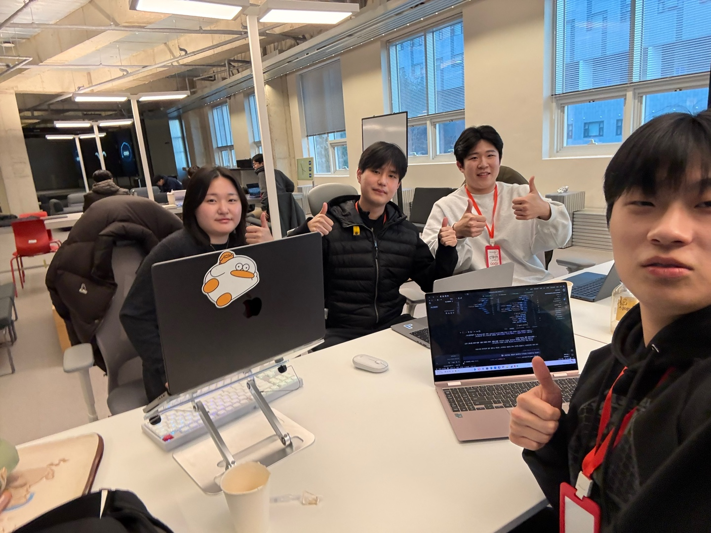

# GCU 6th Team Introduction

가천대학교 GCS 6기 팀 소개 프로젝트입니다.  
전공자 2명(정원준, 전유정)이 비전공자(김채우, 이재빈)에게 VS Code 설치부터 바이브 코딩까지 함께 진행하며, 각자 랜딩 페이지를 제작하는 과정을 담았습니다.



## 프로젝트 개요

- 목적: 팀원별 개성과 스타일을 살린 자기소개 랜딩 페이지 제작
- 진행 방식: 설치/환경세팅부터 코딩, 배포까지 실습 중심으로 진행
- 결과물: 팀 메인 랜딩 + 멤버별 상세 페이지 + 인터랙션 데모

## 랜딩 페이지 구성

- Home(메인): 팀 소개 진입 랜딩
- 원준 페이지: 포켓몬 스타일 인터랙션 자기소개
- 재빈 페이지: 절벽 앞에서도 끊임없지 나아가는 스스로 소개
- 채우 페이지: 하트 비트 형태 자기소개
- 유정 페이지: 불편함 강조 게임 스타일 자기소개

## 기술 스택

- Frontend: React, Vite, Tailwind CSS
- Routing: React Router
- Animation: CSS Animation, Framer Motion
- Deployment: Vercel

## 로컬 실행 방법

```bash
npm install
npm run dev
```

## 빌드

```bash
npm run build
```

## 배포 주소

- https://gcu-6th-team-introduction.vercel.app/
